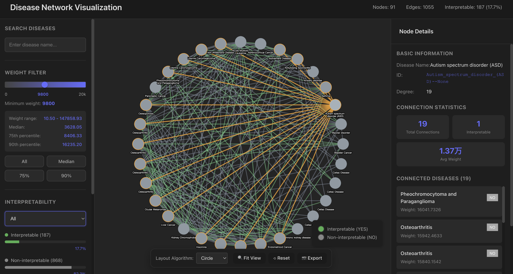

# Pathway Similarity Network

Transcriptomic analysis of 1,300+ disease–condition pairs reveals hidden molecular relationships across diseases using Agentic AI.

## Overview

This project explores disease relationships from a transcriptomic perspective using results generated by the GenoMAS Agentic AI framework. By analyzing over 1,300 disease–condition pairs, we construct disease similarity networks based on shared genes and biological pathways, uncovering both known and previously underexplored molecular connections across diseases. :contentReference[oaicite:0]{index=0}

The project accompanies the paper:

**Discovery of Disease Relationships via Transcriptomic Signature Analysis Powered by Agentic AI**

📄 Paper: https://arxiv.org/abs/2508.04742

---

## Web Visualization

An interactive web platform is available for exploring the disease similarity network:

🌐 Website: https://tianqif2.web.illinois.edu

The platform allows users to:

- Browse disease similarity networks
- Search diseases and disease-condition pairs
- Filter relationships by similarity strength
- Explore biologically interpretable disease connections
- Inspect pathway-level relationships between diseases

A screenshot of the interface is shown below:



The visualization system is based on:

🔗 https://github.com/tfu04/daviz-pathway-similarity-visualization-network

Please refer to that repository for detailed information about the visualization framework and its functionality.

---

### Disease_Similarity.ipynb

Constructs disease similarity networks from transcriptomic signatures and analyzes disease–disease relationships.

### find_shared_genes.ipynb

Identifies significantly shared genes between disease–condition pairs and computes transcriptomic overlap statistics.

### pathway_network_result_with_gpt...

Performs pathway enrichment analysis and generates biological interpretations of disease relationships.

### Drug_Repurposing.ipynb

Explores potential therapeutic hypotheses and drug repurposing opportunities based on disease similarity.

---

## Key Results

- Analysis of 1,384 disease–condition pairs
- 132 diseases across 911 cohorts
- Gene-level disease similarity network
- Pathway-level disease similarity network
- Disease–condition interaction analysis
- Rare disease therapeutic hypothesis generation
- Interactive web-based network exploration

For methodological details and biological findings, please refer to the paper.

---

## Citation

If you use this project, please cite:

```bibtex
@article{chen2025discovery,
  title={Discovery of Disease Relationships via Transcriptomic Signature Analysis Powered by Agentic AI},
  author={Chen, Ke and Wang, Haohan},
  year={2025},
  archivePrefix={arXiv},
  eprint={2508.04742}
}
```
